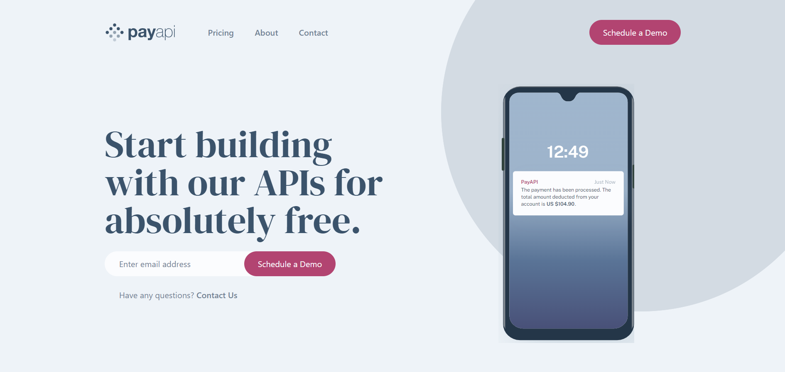

# PayAPI multi-page website

This is a solution to the [PayAPI multi-page website challenge on Frontend Mentor](https://www.frontendmentor.io/challenges/payapi-multipage-website-FDLR1Y11e). Frontend Mentor challenges help you improve your coding skills by building realistic projects. 

## Table of contents

- [Overview](#overview)
  - [The challenge](#the-challenge)
  - [Screenshot](#screenshot)
  - [Links](#links)
- [My process](#my-process)
  - [Built with](#built-with)
  - [What I learned](#what-i-learned)
  - [Continued development](#continued-development)
  - [Useful resources](#useful-resources)
- [Author](#author)


## Overview

### The challenge

Users should be able to:

- View the optimal layout for each page depending on their device's screen size
- See hover states for all interactive elements throughout the site
- Receive an error message when the contact form is submitted if:
  - The `Name`, `Email Address` or `Message` fields are empty should show "This field can't be empty"
  - The `Email Address` is not formatted correctly should show "Please use a valid email address"

### Screenshot Desktop




### Links to be added!

- Solution URL: [Add solution URL here](https://your-solution-url.com)
- Live Site URL: [Add live site URL here](https://your-live-site-url.com)

## My process

### Built with

- Semantic HTML5 markup
- CSS
- Flexbox
- CSS Grid
- Mobile-first workflow
- [SASS](https://sass-lang.com) - CSS preprocessor
- [TailwindCSS](https://tailwindcss.com) - CSS Utility Library
- [React](https://reactjs.org/) - JS library
- [React-Router-6](https://reactrouter.com/en/main) - Routing pages in react


### What I learned

A lot of the techniques and tools I used in this project are things I have used before in previous work but this project provided me with good practice for these things, especially things I haven't used In a while.

One of this things was to create custom checkboxs, I hadn't used these in a while and it was good to jog my memory. I built it by removing the default styles that the browser gives the inputs and then styled it how I wanted, then I used a pseudo element on the input to display the styles I want when checked. I then created a class that then displays the psuedo style when the inputs in a checked state.

Here is the code for the checkbox, including the class to position the checkmark inside the checkbox:
```css
.checkbox-label{
  position: relative;
}

.checkbox-input{
  width: 24px;
  height: 24px;
  appearance: none;
  background-color: rgba(#36536b, .25);
  display: grid;
  place-content: center;
  z-index: 10;
}

.checkbox-input::before{
  content: "";
  width: 24px;
  height: 24px;
  opacity: 0;
  box-shadow: inset 1.5em 1.5em #ba4270;
}

.checkbox-icon{
  position: absolute;
  top: 50%;
  left: 50%;
  transform: translate(-50%,-50%);
  fill: white;
}

.checkbox-input:checked::before{
  opacity: 1;
}
```

In this project I used a lot of inline svgs and in this project I feel like the idea of using the viewbox to control the svg really clicked for me. I had used them before in other projects but this was the one were I felt comfortable for the first time using the viewbox.

By using the viewbox we can control the svg size overall inside of the svg viewport. We can then use the viewport properties to do this. There are four of them and we can use them to control the position of the svg within the svg window. The first controls the svg movement along the x-axis, the second controls the movement along the y-axis, the third controls the width and the fourth the height. We can then use the normal width & height in CSS to control the overall size of the svg once we have the position we want in the svg window using the "viewbox".

Here is an example of the viewbox being used on the background svg I used thoughout the layout.

```html
<svg viewBox="-5 240 790 300" xmlns="http://www.w3.org/2000/svg" xmlns:xlink="http://www.w3.org/1999/xlink"><defs><circle id="one" cx="390" cy="390" r="390"/><circle id="two" cx="390" cy="390" r="390"/></defs><g fill="#36536B" fill-rule="evenodd" opacity=".15"><use xlink:href="#one"/><use xlink:href="#two"/></g></svg>
```

### Useful resources

- [moderncss.dev](https://moderncss.dev/pure-css-custom-checkbox-style) - I used this article here at moderncss.dev by Stephanie Eckles to help jog my memory on styling check boxes.

- [MDN-Docs](https://developer.mozilla.org/en-US/docs/Web/SVG/Attribute/viewBox) - If you want to find out more about the viewbox and svgs in general you can find more information at MDN docs.

## Author

- Website - [David Henery](https://www.djhwebdevelopment.com)

- Frontend Mentor - [@David-Henery4](https://www.frontendmentor.io/profile/David-Henery4)

- linkedIn - [David Henery](https://www.linkedin.com/in/david-henery-725458241)


